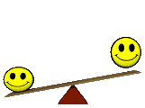

<h2 align="center"> Hey! Nice to see you </h2>

I'm Ajmain Iqtidar Rahman, a passionate self-taught <b>Front End Web Developer</b> from  Bangladesh. EveryOne call me <b><i>Nishu</i></b>. My passion is to explore new technologies. I Spend most of time coding outstanding projects.  I am learn a lot from the open-source community and I love how collaboration and knowledge sharing happened through open-source.

Connect with me!

  

:hearts: &emsp;I enjoy programming. 
:computer: &emsp;most used line of code `console.log("hello world")` 
💼 I'm currently seeking front-end web developer job.
🌱 &nbsp;I’m currently learning JavaScript related things.
:e-mail: &emsp;How to reach me: ajmainnishu@gmail.com. 
⚡ &emsp;Fun fact: Design is my hobby, Coding is my profession and Quality is top priority.

------------

#### Things I learn with
                      

#### Profile Visits

#### Github Stats

